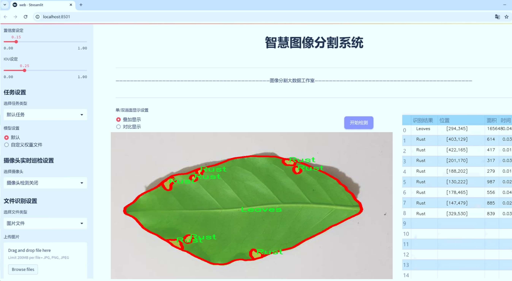
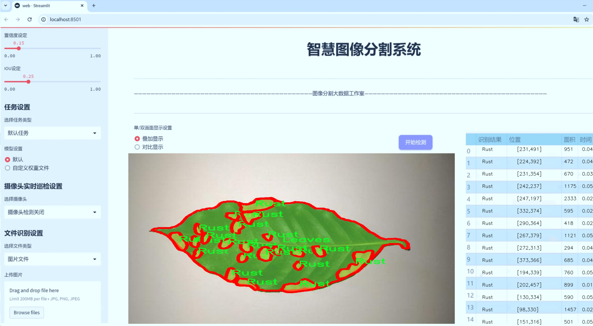
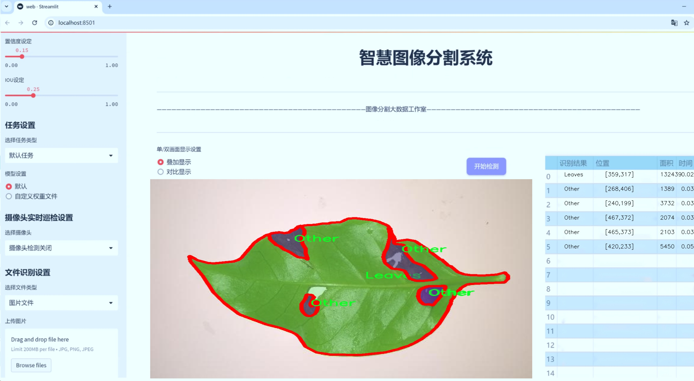
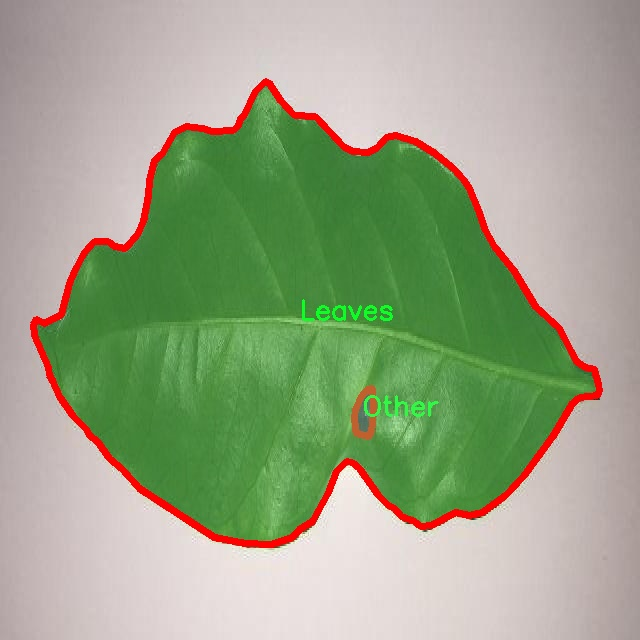
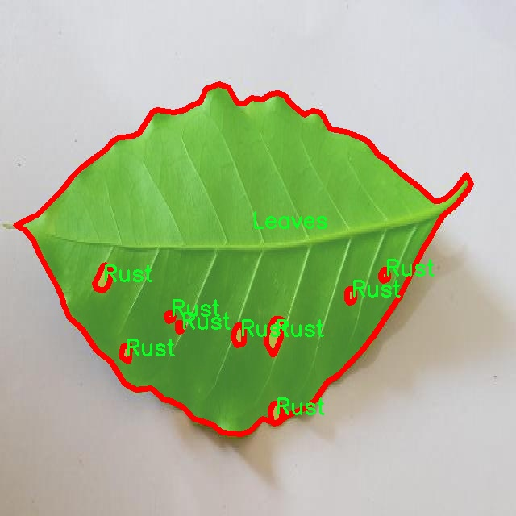
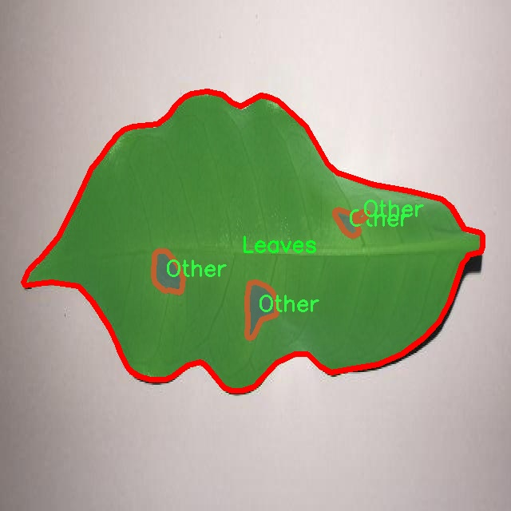
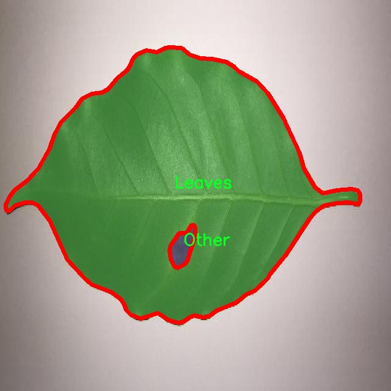
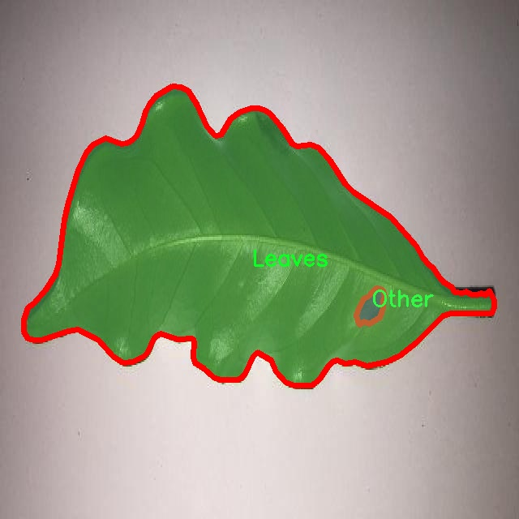

# 咖啡叶锈病分割系统源码＆数据集分享
 [yolov8-seg-C2f-Faster-EMA＆yolov8-seg-SPPF-LSKA等50+全套改进创新点发刊_一键训练教程_Web前端展示]

### 1.研究背景与意义

项目参考[ILSVRC ImageNet Large Scale Visual Recognition Challenge](https://gitee.com/YOLOv8_YOLOv11_Segmentation_Studio/projects)

项目来源[AAAI Global Al lnnovation Contest](https://kdocs.cn/l/cszuIiCKVNis)

研究背景与意义

咖啡叶锈病（Coffee Leaf Rust, CLR）是影响咖啡种植的重要病害之一，严重威胁着全球咖啡产业的可持续发展。根据国际咖啡组织的统计，咖啡叶锈病每年导致数百万美元的经济损失，尤其是在拉丁美洲和非洲等主要咖啡生产地区。随着气候变化的加剧，咖啡叶锈病的传播范围和强度也在不断增加，给咖啡种植者带来了前所未有的挑战。因此，开发有效的监测和管理工具以早期识别和控制咖啡叶锈病显得尤为重要。

在这一背景下，计算机视觉和深度学习技术的迅猛发展为农业病害的检测与管理提供了新的机遇。YOLO（You Only Look Once）系列模型因其高效的实时目标检测能力，已广泛应用于农业领域的病害识别与分割任务。YOLOv8作为该系列的最新版本，具有更强的特征提取能力和更高的检测精度，适合用于复杂的农业环境中。然而，针对咖啡叶锈病的特定需求，YOLOv8的标准模型仍存在一定的局限性，尤其是在细粒度分割和不同类别之间的区分能力方面。因此，基于改进YOLOv8的咖啡叶锈病分割系统的研究具有重要的现实意义。

本研究将利用包含4500张图像的COFFE_RUST_SEGMENTATION数据集，该数据集涵盖了三类重要的目标：咖啡叶、其他物体和锈病斑点。这一数据集的构建为模型的训练和评估提供了丰富的样本基础，使得研究者能够更好地理解和分析咖啡叶锈病的特征及其与健康叶片的区别。通过对数据集的深入分析，研究者可以提取出锈病斑点的特征，进而优化YOLOv8模型的参数设置，以提高其在实际应用中的表现。

改进YOLOv8的咖啡叶锈病分割系统不仅能够实现对咖啡叶锈病的高效识别和精确分割，还能够为咖啡种植者提供实时的病害监测工具，帮助他们及时采取防治措施，降低经济损失。此外，该系统的成功应用也将为其他农业病害的检测提供借鉴，推动农业智能化和数字化的发展。

综上所述，基于改进YOLOv8的咖啡叶锈病分割系统的研究，不仅具有重要的学术价值，还对实际农业生产具有深远的影响。通过提高咖啡叶锈病的检测精度和效率，研究将为全球咖啡产业的可持续发展提供有力支持，助力实现农业生产的智能化转型。

### 2.图片演示







##### 注意：由于此博客编辑较早，上面“2.图片演示”和“3.视频演示”展示的系统图片或者视频可能为老版本，新版本在老版本的基础上升级如下：（实际效果以升级的新版本为准）

  （1）适配了YOLOV8的“目标检测”模型和“实例分割”模型，通过加载相应的权重（.pt）文件即可自适应加载模型。

  （2）支持“图片识别”、“视频识别”、“摄像头实时识别”三种识别模式。

  （3）支持“图片识别”、“视频识别”、“摄像头实时识别”三种识别结果保存导出，解决手动导出（容易卡顿出现爆内存）存在的问题，识别完自动保存结果并导出到tempDir中。

  （4）支持Web前端系统中的标题、背景图等自定义修改，后面提供修改教程。

  另外本项目提供训练的数据集和训练教程,暂不提供权重文件（best.pt）,需要您按照教程进行训练后实现图片演示和Web前端界面演示的效果。

### 3.视频演示

[3.1 视频演示](https://www.bilibili.com/video/BV1JvmqYhEKN/)

### 4.数据集信息展示

##### 4.1 本项目数据集详细数据（类别数＆类别名）

nc: 3
names: ['Leaves', 'Other', 'Rust']


##### 4.2 本项目数据集信息介绍

数据集信息展示

在现代农业中，咖啡叶锈病（Coffee Leaf Rust）已成为影响咖啡生产的重要病害之一，严重威胁着咖啡种植的经济效益与可持续发展。为了有效应对这一挑战，研究者们致力于开发高效的病害检测与分割系统。为此，构建了一个名为“COFFE_RUST_SEGMENTATION”的数据集，旨在为改进YOLOv8-seg模型提供丰富的训练数据，以实现对咖啡叶锈病的精准分割。

“COFFE_RUST_SEGMENTATION”数据集包含三类主要类别，分别为“Leaves”（叶片）、“Other”（其他）和“Rust”（锈病）。这些类别的划分不仅有助于模型在训练过程中识别不同的图像特征，还能提高模型对复杂背景的适应能力。在数据集中，叶片类别代表健康的咖啡叶，作为模型识别的基础特征；而“Other”类别则涵盖了非病害的其他植物部分或背景元素，帮助模型学习如何区分目标与非目标区域；“Rust”类别则专注于病害本身的特征，提供了锈病在叶片上的表现形式，以便模型能够准确识别并分割出受影响的区域。

数据集的构建过程经过了严格的标准化和标注，以确保每一幅图像都能真实反映咖啡叶锈病的不同阶段和表现。图像数据来源于多种环境条件下的咖啡种植园，涵盖了不同光照、气候及生长状态下的咖啡叶。这种多样性不仅增强了数据集的代表性，也为模型的泛化能力提供了坚实的基础。

在数据集的标注过程中，采用了专业的图像标注工具，确保每个类别的边界清晰可辨。标注人员经过专业培训，能够准确识别锈病的特征与健康叶片的差异，保证了数据集的高质量和高准确性。每幅图像的标注信息均以标准格式存储，便于后续模型训练和评估。

通过对“COFFE_RUST_SEGMENTATION”数据集的训练，改进后的YOLOv8-seg模型将能够实现高效的咖啡叶锈病检测与分割。这不仅有助于农民及时发现病害，采取相应的防治措施，还能为农业科研提供重要的数据支持。随着数据集的不断扩展与更新，未来的研究将能够更深入地探讨咖啡叶锈病的特征与影响因素，推动智能农业的发展。

总之，“COFFE_RUST_SEGMENTATION”数据集的构建与应用，不仅为咖啡叶锈病的检测与管理提供了新的思路，也为相关领域的研究者提供了宝贵的资源。通过不断优化模型与数据集，期待在未来能够实现更高效、更智能的农业病害管理方案，为全球咖啡产业的可持续发展贡献力量。











### 5.全套项目环境部署视频教程（零基础手把手教学）

[5.1 环境部署教程链接（零基础手把手教学）](https://www.bilibili.com/video/BV1jG4Ve4E9t/?vd_source=bc9aec86d164b67a7004b996143742dc)


[5.2 安装Python虚拟环境创建和依赖库安装视频教程链接（零基础手把手教学）](https://www.bilibili.com/video/BV1nA4VeYEze/?vd_source=bc9aec86d164b67a7004b996143742dc)

### 6.手把手YOLOV8-seg训练视频教程（零基础小白有手就能学会）

[6.1 手把手YOLOV8-seg训练视频教程（零基础小白有手就能学会）](https://www.bilibili.com/video/BV1cA4VeYETe/?vd_source=bc9aec86d164b67a7004b996143742dc)


按照上面的训练视频教程链接加载项目提供的数据集，运行train.py即可开始训练



     Epoch   gpu_mem       box       obj       cls    labels  img_size
     1/200     0G   0.01576   0.01955  0.007536        22      1280: 100%|██████████| 849/849 [14:42<00:00,  1.04s/it]
               Class     Images     Labels          P          R     mAP@.5 mAP@.5:.95: 100%|██████████| 213/213 [01:14<00:00,  2.87it/s]
                 all       3395      17314      0.994      0.957      0.0957      0.0843

     Epoch   gpu_mem       box       obj       cls    labels  img_size
     2/200     0G   0.01578   0.01923  0.007006        22      1280: 100%|██████████| 849/849 [14:44<00:00,  1.04s/it]
               Class     Images     Labels          P          R     mAP@.5 mAP@.5:.95: 100%|██████████| 213/213 [01:12<00:00,  2.95it/s]
                 all       3395      17314      0.996      0.956      0.0957      0.0845

     Epoch   gpu_mem       box       obj       cls    labels  img_size
     3/200     0G   0.01561    0.0191  0.006895        27      1280: 100%|██████████| 849/849 [10:56<00:00,  1.29it/s]
               Class     Images     Labels          P          R     mAP@.5 mAP@.5:.95: 100%|███████   | 187/213 [00:52<00:00,  4.04it/s]
                 all       3395      17314      0.996      0.957      0.0957      0.0845


### 7.50+种全套YOLOV8-seg创新点代码加载调参视频教程（一键加载写好的改进模型的配置文件）

[7.1 50+种全套YOLOV8-seg创新点代码加载调参视频教程（一键加载写好的改进模型的配置文件）](https://www.bilibili.com/video/BV1Hw4VePEXv/?vd_source=bc9aec86d164b67a7004b996143742dc)

### 8.YOLOV8-seg图像分割算法原理

原始YOLOv8-seg算法原理

YOLOv8-seg算法是2023年由Ultralytics推出的一款前沿目标检测与分割模型，它在YOLO系列的基础上进行了多项创新与优化，旨在提升模型的性能与适用性。YOLOv8-seg不仅在目标检测方面表现出色，还具备了图像分割的能力，使其在复杂场景下的应用更加广泛。该算法的核心在于其独特的网络结构设计，主要由Backbone、Neck和Head三部分组成，形成了一个高效的特征提取与融合框架。

首先，Backbone部分负责从输入图像中提取多层次的特征。YOLOv8的Backbone采用了深度可分离卷积和残差连接等技术，这些设计不仅减少了计算量，还有效提升了特征提取的效率和准确性。通过对图像进行逐层处理，Backbone能够捕捉到从低级到高级的多种特征信息，这对于后续的目标检测和分割任务至关重要。

接下来，Neck部分的设计旨在将Backbone提取的特征进行融合，以便于更好地进行目标检测和分割。YOLOv8的Neck采用了特征金字塔网络（FPN）结构，这种结构能够有效地将不同尺度的特征进行融合，从而增强模型对多尺度目标的检测能力。通过对不同层次特征的加权组合，Neck能够生成更加丰富的特征表示，为后续的Head部分提供更为精准的输入。

在Head部分，YOLOv8-seg算法引入了三个解耦头，分别用于目标检测、实例分割和语义分割任务。这种解耦设计使得模型能够在处理不同任务时，针对性地优化损失函数，从而提升各项任务的性能。具体而言，目标检测头负责输出目标的边界框及其类别信息，而实例分割头则通过像素级的分类来实现对目标的精确分割，语义分割头则用于生成图像中每个像素的语义标签。这种多任务学习的策略不仅提高了模型的整体性能，还使得YOLOv8-seg在复杂场景下的表现更加出色。

值得一提的是，YOLOv8-seg算法在模型设置上也进行了灵活的设计。通过depth_factor、width_factor和ratio等参数，用户可以根据具体需求调整模型的深度、宽度和通道数。这种灵活性使得YOLOv8-seg能够适应不同的应用场景，无论是在资源受限的边缘设备上，还是在计算能力强大的服务器上，均能实现高效的目标检测与分割。

此外，YOLOv8-seg算法还具备了原生支持自定义数据集的能力，这一特性极大地方便了用户在特定领域的应用。用户可以根据自己的需求，快速构建和训练模型，以满足特定的目标检测与分割任务。这种易于训练和调整的特性，使得YOLOv8-seg在工业界和学术界都受到了广泛的关注与应用。

在实际应用中，YOLOv8-seg算法展现出了极高的实时性和准确性，尤其是在农业领域的应用中，例如苹果采摘。通过结合YOLOv8-seg的视觉识别能力，自动采摘机器人能够快速、准确地检测和定位苹果，从而提高采摘效率。此外，结合蚁群算法进行路径规划，使得机器人在复杂环境中能够智能地选择最佳路径，进一步提升了自动化采摘的效率。

综上所述，YOLOv8-seg算法通过其创新的网络结构、灵活的模型设置以及强大的特征提取与融合能力，成为了目标检测与分割领域的一个重要里程碑。它不仅继承了YOLO系列的优良传统，还在多个方面进行了突破与创新，极大地推动了目标检测技术的发展。随着YOLOv8-seg的不断应用与优化，未来在更多领域的潜力将会被进一步挖掘，为智能化和自动化的进程注入新的动力。


### 9.系统功能展示（检测对象为举例，实际内容以本项目数据集为准）

图9.1.系统支持检测结果表格显示

  图9.2.系统支持置信度和IOU阈值手动调节

  图9.3.系统支持自定义加载权重文件best.pt(需要你通过步骤5中训练获得)

  图9.4.系统支持摄像头实时识别

  图9.5.系统支持图片识别

  图9.6.系统支持视频识别

  图9.7.系统支持识别结果文件自动保存

  图9.8.系统支持Excel导出检测结果数据


### 10.50+种全套YOLOV8-seg创新点原理讲解（非科班也可以轻松写刊发刊，V11版本正在科研待更新）

#### 10.1 由于篇幅限制，每个创新点的具体原理讲解就不一一展开，具体见下列网址中的创新点对应子项目的技术原理博客网址【Blog】：


[10.1 50+种全套YOLOV8-seg创新点原理讲解链接](https://gitee.com/qunmasj/good)

#### 10.2 部分改进模块原理讲解(完整的改进原理见上图和技术博客链接)【如果此小节的图加载失败可以通过CSDN或者Github搜索该博客的标题访问原始博客，原始博客图片显示正常】
### YOLOv8简介
目前YOLO系列的SOTA模型是ultralytics公司于2023年发布的YOLOv8.按照模型宽度和深度不同分为YOLOv8n、YOLOv8s、YOLOv8m、YOLOv81、YOLOv8x五个版本。本文改进的是 YOLOv8n模型。
YOLOv8的 Backbone采用CSPDarknet结构，它是 Darknet 的一种改进，引入CSP改善网络结构。CSPDarknet把特征图分为两部分，一部分进行卷积操作，另一部分进行跳跃连接，在保持网络深度的同时减少参数量和计算量，提高网络效率。Neck 部分采用特征金字塔PANet[17]，通过自顶向下路径结合和自底向上特征传播进行多尺度融合。损失函数采用了CIloU[18]。YOLOv8的网络结构如图所示。


### ParC融合位置感知循环卷积简介
ParC：Position aware circular convolution


#### Position aware circular convolution
针对于全局信息的提取作者提出了Position aware circular convolution（也称作Global Circular Convolution）。图中左右实际是对于该操作水平竖直两方向的对称，理解时只看左边即可。对于维度为C*H*W的输入，作者先将维度为C*B*1的Position Embedding通过双线性插值函数F调整到适合input的维度C*H*1（以适应不同特征大小输入），并且将PE水平复制扩展到C*H*W维度与输入特征相加。这里作者将PE直接设置成为了可学习的参数。

接下来参考该博客将加入PE的特征图竖直方向堆叠，并且同样以插值的方式得到了适应输入维度的C*H*1大小的卷积核，进行卷积操作。对于这一步卷积，作者将之称为循环卷积，并给出了一个卷积示意图。


但个人感觉实际上这个示意图只是为了说明为什么叫循环卷积，对于具体的计算细节还是根据公式理解更好。


进一步，作者给出了这一步的伪代码来便于读者对这一卷积的理解：y=F.conv2D（torch.cat（xp，xp，dim=2），kV），实际上就是将xp堆叠之后使用了一个“条形（或柱形）”卷积核进行简单的卷积操作。（但这样会导致多一次重复卷积，因此在堆叠示意图中只取了前2*H-1行）

可以看到在示意图中特征维度变化如下：C*(2H-1)*W ---C*H*1--->C*H*W，作者特意带上了通道数，并且并没有出现通道数的改变，那么这里所进行的卷积应该是depth wise卷积，通过对文章后续以及论文源码的阅读可以得知这一步进行的就是DW卷积。（we introduce group convolution and point wise convolution into these modules, which decreases number of parameters without hurting performance.）


由groups = channel可知使用的是DW卷积
通过上面就完成了一次竖直方向的全局信息交流，同样只要在水平方向进行同样的操作即可做到水平方向的全局信息交流。

#### ParC block

通过ParC成功解决了全局信息提取的问题，接下来就是针对2）3）两点进行改进。首先是Meta-Former模块，Meta-Former由Token Mixer和Channel Mixer构成，ParC首先满足了Token Mixer的全局信息提取的要求，并且相较于Attention在计算成本上更低。


这里①中的PWC即point wise conv，进一步验证了我们前面对于深度可分离卷积的想法，而GCC-H/V即是前面所说的ParC-H/V。

①构建了Meta-Former中的Token mixer模块，那么最后剩下的问题就是3），替换掉Attention模块之后模型不再data driven。为了解决这一点作者给出了一个channel wise attention，先将特征图（x,C*H*W）进行global average（a,C*1*1）并输入一个MLP生成一个channel wise的权重（w,C*1*1），再将权重与特征图在通道方向相乘得到输出（output = wx,C*H*W）。

#### ParC net
对于ParC net 的搭建，作者直接基于MobileViT，采用了分叉结构（c）完成了网络的搭建。


具体而言作者保留了MobileViT中浅层具有局部感受野的MobileNetV2结构，而将网络深层的ViT block替换成了ParC block，使网络变成了一个pure ConvNet。


### 11.项目核心源码讲解（再也不用担心看不懂代码逻辑）

#### 11.1 ultralytics\data\__init__.py

以下是对给定代码的核心部分进行提炼和详细注释的结果：

```python
# 引入必要的模块和类
from .base import BaseDataset  # 导入基础数据集类
from .build import build_dataloader, build_yolo_dataset, load_inference_source  # 导入构建数据加载器和YOLO数据集的函数
from .dataset import ClassificationDataset, SemanticDataset, YOLODataset  # 导入不同类型的数据集类

# 定义模块的公开接口，包含可供外部使用的类和函数
__all__ = (
    'BaseDataset',          # 基础数据集类
    'ClassificationDataset', # 分类数据集类
    'SemanticDataset',      # 语义分割数据集类
    'YOLODataset',          # YOLO特定的数据集类
    'build_yolo_dataset',   # 构建YOLO数据集的函数
    'build_dataloader',     # 构建数据加载器的函数
    'load_inference_source'  # 加载推理源的函数
)
```

### 代码核心部分分析：
1. **模块导入**：
   - 代码首先从不同的模块中导入了基础类和函数，这些是构建YOLO模型和处理数据的核心组件。

2. **`__all__` 变量**：
   - `__all__` 是一个特殊的变量，用于定义当使用 `from module import *` 时，哪些类和函数会被导入。这样可以控制模块的公共接口，隐藏内部实现细节。

### 详细注释：
- `BaseDataset`：这是一个基础数据集类，可能包含了数据集的基本操作和属性，其他数据集类可能会继承自它。
- `ClassificationDataset`：用于处理分类任务的数据集类，可能包含特定于分类的数据加载和预处理方法。
- `SemanticDataset`：用于语义分割任务的数据集类，可能实现了与语义分割相关的数据处理逻辑。
- `YOLODataset`：专门为YOLO模型设计的数据集类，可能实现了YOLO特有的数据加载和标签处理方式。
- `build_yolo_dataset`：一个函数，用于构建YOLO数据集，可能会根据配置文件或参数生成相应的数据集实例。
- `build_dataloader`：用于构建数据加载器的函数，负责将数据集与PyTorch的数据加载机制连接起来，以便于训练和推理。
- `load_inference_source`：加载推理源的函数，可能用于准备推理时所需的数据或模型。

通过这些核心部分和注释，可以更好地理解代码的结构和功能。

这个文件是Ultralytics YOLO项目中的一个初始化文件，通常用于定义模块的公共接口。在这个文件中，首先引入了一些基础组件和数据集类，这些组件和类在YOLO模型的训练和推理过程中起着重要作用。

文件开头的注释表明该项目使用的是AGPL-3.0许可证，并且是Ultralytics YOLO的一个部分。接下来，通过相对导入的方式，引入了几个关键的模块和类：

- `BaseDataset`：这是一个基础数据集类，可能提供了一些通用的方法和属性，供其他具体数据集类继承和使用。
- `build_dataloader`：这个函数用于构建数据加载器，数据加载器是训练过程中用来批量加载数据的工具。
- `build_yolo_dataset`：这个函数用于构建YOLO特定的数据集，可能会处理数据的预处理和增强等操作。
- `load_inference_source`：这个函数用于加载推理所需的数据源，可能涉及到模型推理时的数据准备。

此外，还引入了三个具体的数据集类：

- `ClassificationDataset`：用于分类任务的数据集类。
- `SemanticDataset`：用于语义分割任务的数据集类。
- `YOLODataset`：专门为YOLO模型设计的数据集类，可能包含YOLO特有的数据处理逻辑。

最后，`__all__`变量定义了该模块的公共接口，指定了在使用`from module import *`时可以导入的类和函数。这种做法有助于控制模块的可见性，确保用户只接触到模块的核心功能，而不暴露内部实现细节。

总的来说，这个文件的主要作用是组织和暴露与数据集相关的功能，使得其他模块可以方便地使用这些功能来进行模型训练和推理。

#### 11.2 ultralytics\models\fastsam\predict.py

以下是代码中最核心的部分，并附上详细的中文注释：

```python
import torch
from ultralytics.engine.results import Results
from ultralytics.models.fastsam.utils import bbox_iou
from ultralytics.models.yolo.detect.predict import DetectionPredictor
from ultralytics.utils import ops

class FastSAMPredictor(DetectionPredictor):
    """
    FastSAMPredictor 类专门用于在 Ultralytics YOLO 框架中进行快速 SAM（Segment Anything Model）分割预测任务。
    该类扩展了 DetectionPredictor，定制了预测管道，特别针对快速 SAM 进行了调整。
    """

    def __init__(self, cfg=DEFAULT_CFG, overrides=None, _callbacks=None):
        """
        初始化 FastSAMPredictor 类，继承自 DetectionPredictor，并将任务设置为 'segment'（分割）。

        Args:
            cfg (dict): 预测的配置参数。
            overrides (dict, optional): 可选的参数覆盖，用于自定义行为。
            _callbacks (dict, optional): 可选的回调函数列表，在预测过程中调用。
        """
        super().__init__(cfg, overrides, _callbacks)
        self.args.task = 'segment'  # 设置任务为分割

    def postprocess(self, preds, img, orig_imgs):
        """
        对预测结果进行后处理，包括非极大值抑制和将框缩放到原始图像大小，并返回最终结果。

        Args:
            preds (list): 模型的原始输出预测。
            img (torch.Tensor): 处理后的图像张量。
            orig_imgs (list | torch.Tensor): 原始图像或图像列表。

        Returns:
            (list): 包含处理后的框、掩码和其他元数据的 Results 对象列表。
        """
        # 进行非极大值抑制，过滤掉低置信度的预测框
        p = ops.non_max_suppression(
            preds[0],
            self.args.conf,
            self.args.iou,
            agnostic=self.args.agnostic_nms,
            max_det=self.args.max_det,
            nc=1,  # 设置为 1 类，因为 SAM 没有类预测
            classes=self.args.classes)

        # 创建一个全框，用于存储预测结果
        full_box = torch.zeros(p[0].shape[1], device=p[0].device)
        full_box[2], full_box[3], full_box[4], full_box[6:] = img.shape[3], img.shape[2], 1.0, 1.0
        full_box = full_box.view(1, -1)

        # 计算 IOU，筛选出符合条件的预测框
        critical_iou_index = bbox_iou(full_box[0][:4], p[0][:, :4], iou_thres=0.9, image_shape=img.shape[2:])
        if critical_iou_index.numel() != 0:
            full_box[0][4] = p[0][critical_iou_index][:, 4]
            full_box[0][6:] = p[0][critical_iou_index][:, 6:]
            p[0][critical_iou_index] = full_box  # 更新预测框

        # 将输入图像转换为 numpy 格式（如果需要）
        if not isinstance(orig_imgs, list):
            orig_imgs = ops.convert_torch2numpy_batch(orig_imgs)

        results = []  # 存储最终结果
        proto = preds[1][-1] if len(preds[1]) == 3 else preds[1]  # 获取掩码原型

        # 遍历每个预测结果
        for i, pred in enumerate(p):
            orig_img = orig_imgs[i]  # 获取原始图像
            img_path = self.batch[0][i]  # 获取图像路径

            if not len(pred):  # 如果没有预测框，保存空框
                masks = None
            elif self.args.retina_masks:
                # 处理掩码并缩放框
                pred[:, :4] = ops.scale_boxes(img.shape[2:], pred[:, :4], orig_img.shape)
                masks = ops.process_mask_native(proto[i], pred[:, 6:], pred[:, :4], orig_img.shape[:2])  # HWC
            else:
                masks = ops.process_mask(proto[i], pred[:, 6:], pred[:, :4], img.shape[2:], upsample=True)  # HWC
                pred[:, :4] = ops.scale_boxes(img.shape[2:], pred[:, :4], orig_img.shape)  # 缩放框
            # 将结果存储到 Results 对象中
            results.append(Results(orig_img, path=img_path, names=self.model.names, boxes=pred[:, :6], masks=masks))
        
        return results  # 返回最终结果列表
```

### 代码核心部分说明：
1. **类定义**：`FastSAMPredictor` 继承自 `DetectionPredictor`，专门用于快速的 SAM 分割任务。
2. **初始化方法**：设置任务为分割，并调用父类的初始化方法。
3. **后处理方法**：对模型的原始预测结果进行后处理，包括非极大值抑制、框的缩放和掩码的处理，最终返回包含结果的列表。

这个程序文件是一个用于快速分割任务的预测器，名为 `FastSAMPredictor`，它是基于 Ultralytics YOLO 框架的。该类继承自 `DetectionPredictor`，并专门为快速的 SAM（Segment Anything Model）分割预测任务进行了定制。程序中定义了几个重要的属性和方法，以实现高效的图像分割。

在类的初始化方法 `__init__` 中，调用了父类的构造函数，并将任务类型设置为“分割”。这意味着该预测器将专注于图像分割，而不是其他类型的检测任务。初始化时可以接收配置参数、可选的参数覆盖和回调函数，这些参数可以用来定制预测行为。

`postprocess` 方法是该类的核心功能之一，它负责对模型的原始输出进行后处理。具体来说，这个方法执行非极大值抑制（non-max suppression），以消除冗余的预测框，并将预测框的大小缩放到原始图像的尺寸。方法接收三个参数：模型的原始预测结果、处理后的图像张量以及原始图像或图像列表。

在 `postprocess` 方法中，首先使用 `ops.non_max_suppression` 函数对预测结果进行非极大值抑制，确保只保留最相关的预测框。接着，创建一个全框（`full_box`），并根据输入图像的尺寸进行初始化。然后，通过计算与全框的 IoU（Intersection over Union）来筛选出关键的预测框，并更新全框的相关信息。

接下来，程序检查输入的原始图像是否为列表，如果不是，则将其转换为 NumPy 格式。然后，程序遍历每个预测结果，处理掩码（masks）并将结果存储在 `results` 列表中。根据是否启用视网膜掩码（retina masks），选择不同的掩码处理方式，并确保预测框的大小与原始图像相匹配。

最后，`postprocess` 方法返回一个包含处理后结果的列表，每个结果对象包含原始图像、路径、类别名称、预测框和掩码等信息。这使得后续的分析和可视化变得更加方便。

总体而言，这个程序文件实现了一个高效的分割预测器，能够在 Ultralytics YOLO 框架下快速处理图像并生成准确的分割结果。

#### 11.3 ultralytics\engine\validator.py

以下是代码中最核心的部分，并附上详细的中文注释：

```python
class BaseValidator:
    """
    BaseValidator类用于创建验证器的基类。

    属性:
        args (SimpleNamespace): 验证器的配置。
        dataloader (DataLoader): 用于验证的数据加载器。
        model (nn.Module): 要验证的模型。
        device (torch.device): 用于验证的设备。
        speed (dict): 包含预处理、推理、损失和后处理的速度信息。
        save_dir (Path): 保存结果的目录。
    """

    def __init__(self, dataloader=None, save_dir=None, args=None):
        """
        初始化BaseValidator实例。

        参数:
            dataloader (torch.utils.data.DataLoader): 用于验证的数据加载器。
            save_dir (Path, optional): 保存结果的目录。
            args (SimpleNamespace): 验证器的配置。
        """
        self.args = get_cfg(overrides=args)  # 获取配置
        self.dataloader = dataloader  # 设置数据加载器
        self.model = None  # 初始化模型为None
        self.device = None  # 初始化设备为None
        self.speed = {'preprocess': 0.0, 'inference': 0.0, 'loss': 0.0, 'postprocess': 0.0}  # 初始化速度字典
        self.save_dir = save_dir or get_save_dir(self.args)  # 设置保存目录

    @smart_inference_mode()
    def __call__(self, trainer=None, model=None):
        """支持验证预训练模型或正在训练的模型。"""
        self.device = select_device(self.args.device)  # 选择设备
        model = AutoBackend(model or self.args.model, device=self.device)  # 初始化模型
        model.eval()  # 设置模型为评估模式

        # 遍历数据加载器
        for batch_i, batch in enumerate(self.dataloader):
            # 预处理
            batch = self.preprocess(batch)

            # 推理
            preds = model(batch['img'])

            # 更新指标
            self.update_metrics(preds, batch)

        # 打印结果
        self.print_results()

    def preprocess(self, batch):
        """预处理输入批次。"""
        return batch  # 返回原始批次（可根据需要进行修改）

    def update_metrics(self, preds, batch):
        """根据预测和批次更新指标。"""
        pass  # 具体实现根据需求进行定义

    def print_results(self):
        """打印模型预测的结果。"""
        pass  # 具体实现根据需求进行定义
```

### 代码说明：
1. **BaseValidator类**：这是一个用于模型验证的基类，包含了模型验证所需的基本属性和方法。
2. **初始化方法**：在初始化时，获取配置、设置数据加载器、模型和设备，并初始化速度信息和保存目录。
3. **`__call__`方法**：使得类的实例可以被调用，支持验证预训练模型或正在训练的模型。它选择设备，初始化模型并设置为评估模式，然后遍历数据加载器进行验证。
4. **预处理和更新指标**：`preprocess`方法用于处理输入数据，`update_metrics`方法用于更新验证过程中所需的指标，这两个方法可以根据具体需求进行扩展。
5. **打印结果**：`print_results`方法用于输出验证结果，具体实现需要根据需求进行定义。

这些核心部分是模型验证的基础，其他方法可以根据具体的需求进行实现和扩展。

这个程序文件 `ultralytics/engine/validator.py` 是一个用于验证模型准确性的基类，主要用于 YOLO（You Only Look Once）系列模型的验证过程。文件中包含了一个名为 `BaseValidator` 的类，负责处理模型的验证逻辑。

首先，文件开头包含了一些使用说明，指明了如何使用这个验证器，包括不同格式的模型文件支持。接着，文件导入了一些必要的库和模块，包括 JSON 处理、时间处理、路径处理、NumPy 和 PyTorch 等。

`BaseValidator` 类的构造函数 `__init__` 初始化了一些属性，例如数据加载器、保存目录、进度条、模型参数等。它还会根据传入的参数设置一些默认值，比如置信度阈值和图像大小，并创建保存结果的目录。

`__call__` 方法是验证的核心逻辑。它支持对预训练模型或正在训练的模型进行验证。根据是否有训练器对象，方法会选择相应的模型和设备进行验证。它会进行模型的评估模式设置、数据集检查、数据加载器的获取等操作，并在验证过程中记录每个批次的处理时间。

在验证过程中，`BaseValidator` 会调用一系列的回调函数，这些回调函数可以在验证的不同阶段执行特定的操作，比如开始验证、每个批次开始和结束等。验证的主要步骤包括数据预处理、模型推理、损失计算和后处理等。

`match_predictions` 方法用于将模型的预测结果与真实标签进行匹配，使用 IoU（Intersection over Union）来评估预测的准确性。这个方法支持使用 SciPy 库进行更精确的匹配。

此外，类中还定义了一些方法用于处理回调、获取数据加载器、构建数据集、预处理和后处理数据、初始化和更新性能指标等。这些方法为子类提供了接口，以便实现具体的验证逻辑。

最后，类中还有一些占位符方法（如 `get_dataloader` 和 `build_dataset`），这些方法需要在子类中实现，以适应不同的数据集和验证需求。

总的来说，这个文件为 YOLO 模型的验证提供了一个基础框架，用户可以通过继承 `BaseValidator` 类并实现具体的方法来完成特定的数据集验证任务。

#### 11.4 ultralytics\utils\dist.py

以下是经过简化和注释的核心代码部分：

```python
import os
import re
import shutil
import socket
import sys
import tempfile
from pathlib import Path

from . import USER_CONFIG_DIR
from .torch_utils import TORCH_1_9

def find_free_network_port() -> int:
    """
    查找本地主机上可用的网络端口。

    在单节点训练时非常有用，因为我们不想连接到真实的主节点，但必须设置
    `MASTER_PORT` 环境变量。
    """
    with socket.socket(socket.AF_INET, socket.SOCK_STREAM) as s:
        s.bind(('127.0.0.1', 0))  # 绑定到本地地址和随机端口
        return s.getsockname()[1]  # 返回分配的端口号

def generate_ddp_file(trainer):
    """生成 DDP 文件并返回其文件名。"""
    # 获取训练器的模块和类名
    module, name = f'{trainer.__class__.__module__}.{trainer.__class__.__name__}'.rsplit('.', 1)

    # 构建 DDP 文件的内容
    content = f'''overrides = {vars(trainer.args)} \nif __name__ == "__main__":
    from {module} import {name}
    from ultralytics.utils import DEFAULT_CFG_DICT

    cfg = DEFAULT_CFG_DICT.copy()
    cfg.update(save_dir='')   # 处理额外的 'save_dir' 键
    trainer = {name}(cfg=cfg, overrides=overrides)
    trainer.train()'''
    
    # 创建 DDP 目录（如果不存在）
    (USER_CONFIG_DIR / 'DDP').mkdir(exist_ok=True)
    
    # 创建临时文件并写入内容
    with tempfile.NamedTemporaryFile(prefix='_temp_',
                                     suffix=f'{id(trainer)}.py',
                                     mode='w+',
                                     encoding='utf-8',
                                     dir=USER_CONFIG_DIR / 'DDP',
                                     delete=False) as file:
        file.write(content)  # 写入生成的内容
    return file.name  # 返回临时文件名

def generate_ddp_command(world_size, trainer):
    """生成并返回用于分布式训练的命令。"""
    import __main__  # 本地导入以避免潜在问题
    if not trainer.resume:
        shutil.rmtree(trainer.save_dir)  # 删除保存目录

    file = str(Path(sys.argv[0]).resolve())  # 获取当前脚本的绝对路径
    # 定义允许的文件名模式
    safe_pattern = re.compile(r'^[a-zA-Z0-9_. /\\-]{1,128}$')
    
    # 检查文件名是否安全且存在
    if not (safe_pattern.match(file) and Path(file).exists() and file.endswith('.py')):
        file = generate_ddp_file(trainer)  # 生成 DDP 文件

    # 根据 PyTorch 版本选择分布式命令
    dist_cmd = 'torch.distributed.run' if TORCH_1_9 else 'torch.distributed.launch'
    port = find_free_network_port()  # 查找可用端口
    # 构建命令列表
    cmd = [sys.executable, '-m', dist_cmd, '--nproc_per_node', f'{world_size}', '--master_port', f'{port}', file]
    return cmd, file  # 返回命令和文件名

def ddp_cleanup(trainer, file):
    """如果创建了临时文件，则删除它。"""
    if f'{id(trainer)}.py' in file:  # 检查文件名是否包含临时文件后缀
        os.remove(file)  # 删除临时文件
```

### 代码注释说明：
1. **find_free_network_port**: 该函数用于查找本地主机上可用的网络端口，适用于设置分布式训练的环境变量。
2. **generate_ddp_file**: 该函数生成一个用于分布式数据并行（DDP）训练的 Python 文件，并返回该文件的路径。
3. **generate_ddp_command**: 该函数生成用于启动分布式训练的命令，包括检查当前脚本的有效性和构建命令行参数。
4. **ddp_cleanup**: 该函数用于清理生成的临时文件，以避免不必要的文件残留。

这个程序文件 `ultralytics/utils/dist.py` 是用于支持分布式训练的工具，主要涉及到在单节点上进行训练时的网络端口管理、生成分布式训练的脚本文件以及清理临时文件等功能。

首先，文件导入了一些必要的模块，包括操作系统相关的模块、正则表达式、网络套接字、临时文件处理以及路径管理等。此外，还引入了用户配置目录和一些与 PyTorch 相关的工具。

`find_free_network_port` 函数用于查找本地主机上一个可用的网络端口。这个功能在单节点训练时非常有用，因为我们需要设置 `MASTER_PORT` 环境变量，但不想连接到真实的主节点。该函数通过创建一个套接字并绑定到一个随机端口来实现这一点，返回找到的可用端口号。

`generate_ddp_file` 函数负责生成一个用于分布式数据并行（DDP）训练的 Python 文件，并返回该文件的名称。它通过获取训练器的类信息和参数，构建出一个包含训练逻辑的脚本内容。然后，它在用户配置目录下创建一个名为 `DDP` 的文件夹（如果不存在的话），并将生成的内容写入一个临时文件中，最后返回这个临时文件的名称。

`generate_ddp_command` 函数用于生成分布式训练的命令。它首先检查训练器是否需要恢复训练，如果不需要，则删除保存目录。接着，它获取当前脚本的路径，并使用正则表达式检查该路径是否安全（即是否符合特定的字符和长度限制）。如果路径不安全或不存在，它会调用 `generate_ddp_file` 来生成一个临时文件。然后，函数确定使用的分布式命令（根据 PyTorch 版本选择 `torch.distributed.run` 或 `torch.distributed.launch`），并调用 `find_free_network_port` 来获取一个可用的端口。最终，它构建并返回一个包含执行命令的列表和临时文件名的元组。

最后，`ddp_cleanup` 函数用于在训练结束后清理临时文件。如果临时文件的名称中包含训练器的 ID，函数会删除该文件，以避免留下不必要的临时文件。

总体而言，这个文件提供了一系列工具函数，旨在简化和管理分布式训练过程中的文件和网络配置，确保训练能够顺利进行。

#### 11.5 ultralytics\nn\__init__.py

```python
# 导入所需的模型任务类和函数
from .tasks import (BaseModel, ClassificationModel, DetectionModel, SegmentationModel, 
                    attempt_load_one_weight, attempt_load_weights, guess_model_scale, 
                    guess_model_task, parse_model, torch_safe_load, yaml_model_load)

# 定义模块的公开接口，包含可以被外部访问的类和函数
__all__ = ('attempt_load_one_weight', 'attempt_load_weights', 'parse_model', 'yaml_model_load', 
           'guess_model_task', 'guess_model_scale', 'torch_safe_load', 
           'DetectionModel', 'SegmentationModel', 'ClassificationModel', 'BaseModel')
```

### 代码核心部分说明：
1. **导入模块**：
   - 通过 `from .tasks import ...` 导入了多个模型相关的类和函数。这些类和函数是实现不同任务（如分类、检测、分割等）的基础。

2. **公开接口定义**：
   - `__all__` 是一个特殊变量，用于定义模块的公共接口。当使用 `from module import *` 语句时，只有在 `__all__` 中列出的名称会被导入。这有助于控制模块的可见性，避免不必要的名称冲突和隐藏实现细节。

### 具体导入内容：
- **模型类**：
  - `BaseModel`：基础模型类，可能包含通用的模型方法和属性。
  - `ClassificationModel`：分类模型类，用于图像分类任务。
  - `DetectionModel`：检测模型类，用于物体检测任务。
  - `SegmentationModel`：分割模型类，用于图像分割任务。

- **函数**：
  - `attempt_load_one_weight`：尝试加载单个权重文件的函数。
  - `attempt_load_weights`：尝试加载多个权重文件的函数。
  - `guess_model_scale`：根据输入推测模型的规模。
  - `guess_model_task`：根据输入推测模型的任务类型。
  - `parse_model`：解析模型结构的函数。
  - `torch_safe_load`：安全加载 PyTorch 模型的函数。
  - `yaml_model_load`：从 YAML 文件加载模型配置的函数。

这个程序文件是Ultralytics YOLO项目的一部分，主要用于模型的加载和管理。文件的开头包含了一个版权声明，表明该代码遵循AGPL-3.0许可证。

接下来，文件通过相对导入的方式引入了多个类和函数，这些类和函数都来自于同一目录下的`tasks`模块。具体来说，导入的内容包括四个模型类：`BaseModel`、`ClassificationModel`、`DetectionModel`和`SegmentationModel`，这些类分别用于基础模型、分类模型、检测模型和分割模型的定义和操作。此外，还导入了一些辅助函数，如`attempt_load_one_weight`、`attempt_load_weights`、`guess_model_scale`、`guess_model_task`、`parse_model`、`torch_safe_load`和`yaml_model_load`，这些函数主要用于模型权重的加载、模型任务的推测、模型的解析以及从YAML文件中加载模型配置等。

最后，`__all__`变量定义了该模块的公共接口，列出了可以被外部访问的名称。这意味着当使用`from ultralytics.nn import *`这样的语句时，只会导入`__all__`中列出的内容，从而控制模块的可见性和使用范围。这种做法有助于提高代码的可维护性和可读性，同时避免不必要的命名冲突。

### 12.系统整体结构（节选）

### 整体功能和构架概括

Ultralytics YOLO项目是一个用于目标检测和图像分割的深度学习框架，具有高度模块化的设计。项目的整体功能包括数据处理、模型训练、模型验证和分布式训练等。以下是项目的主要组成部分：

1. **数据处理**：通过 `ultralytics\data\__init__.py` 文件定义数据集的基本结构和加载方式，为模型训练提供所需的数据。
2. **模型预测**：`ultralytics\models\fastsam\predict.py` 文件实现了快速分割模型的预测逻辑，处理输入图像并生成分割结果。
3. **模型验证**：`ultralytics\engine\validator.py` 文件提供了验证模型性能的基础框架，支持不同的数据集和评估指标。
4. **分布式训练支持**：`ultralytics\utils\dist.py` 文件包含了分布式训练所需的工具函数，帮助管理网络端口和生成训练脚本。
5. **模型管理**：`ultralytics\nn\__init__.py` 文件负责模型的加载和管理，提供了模型类和辅助函数的接口。

### 文件功能整理表

| 文件路径                                   | 功能描述                                                                                      |
|--------------------------------------------|-----------------------------------------------------------------------------------------------|
| `ultralytics\data\__init__.py`            | 定义数据集的基本结构和加载方式，包含数据集类和数据加载器的构建函数。                               |
| `ultralytics\models\fastsam\predict.py`   | 实现快速分割模型的预测逻辑，处理输入图像并生成分割结果，包含后处理和结果格式化功能。                   |
| `ultralytics\engine\validator.py`         | 提供模型验证的基础框架，支持不同的数据集和评估指标，包含模型性能评估和结果记录功能。                   |
| `ultralytics\utils\dist.py`               | 支持分布式训练的工具函数，管理网络端口、生成分布式训练脚本和清理临时文件。                           |
| `ultralytics\nn\__init__.py`              | 管理模型的加载和配置，定义模型类和辅助函数的接口，控制模块的可见性和使用范围。                       |

这个表格总结了每个文件的主要功能，展示了Ultralytics YOLO项目的模块化设计和各个组件之间的协作关系。

注意：由于此博客编辑较早，上面“11.项目核心源码讲解（再也不用担心看不懂代码逻辑）”中部分代码可能会优化升级，仅供参考学习，完整“训练源码”、“Web前端界面”和“50+种创新点源码”以“14.完整训练+Web前端界面+50+种创新点源码、数据集获取”的内容为准。

### 13.图片、视频、摄像头图像分割Demo(去除WebUI)代码

在这个博客小节中，我们将讨论如何在不使用WebUI的情况下，实现图像分割模型的使用。本项目代码已经优化整合，方便用户将分割功能嵌入自己的项目中。
核心功能包括图片、视频、摄像头图像的分割，ROI区域的轮廓提取、类别分类、周长计算、面积计算、圆度计算以及颜色提取等。
这些功能提供了良好的二次开发基础。

### 核心代码解读

以下是主要代码片段，我们会为每一块代码进行详细的批注解释：

```python
import random
import cv2
import numpy as np
from PIL import ImageFont, ImageDraw, Image
from hashlib import md5
from model import Web_Detector
from chinese_name_list import Label_list

# 根据名称生成颜色
def generate_color_based_on_name(name):
    ......

# 计算多边形面积
def calculate_polygon_area(points):
    return cv2.contourArea(points.astype(np.float32))

...
# 绘制中文标签
def draw_with_chinese(image, text, position, font_size=20, color=(255, 0, 0)):
    image_pil = Image.fromarray(cv2.cvtColor(image, cv2.COLOR_BGR2RGB))
    draw = ImageDraw.Draw(image_pil)
    font = ImageFont.truetype("simsun.ttc", font_size, encoding="unic")
    draw.text(position, text, font=font, fill=color)
    return cv2.cvtColor(np.array(image_pil), cv2.COLOR_RGB2BGR)

# 动态调整参数
def adjust_parameter(image_size, base_size=1000):
    max_size = max(image_size)
    return max_size / base_size

# 绘制检测结果
def draw_detections(image, info, alpha=0.2):
    name, bbox, conf, cls_id, mask = info['class_name'], info['bbox'], info['score'], info['class_id'], info['mask']
    adjust_param = adjust_parameter(image.shape[:2])
    spacing = int(20 * adjust_param)

    if mask is None:
        x1, y1, x2, y2 = bbox
        aim_frame_area = (x2 - x1) * (y2 - y1)
        cv2.rectangle(image, (x1, y1), (x2, y2), color=(0, 0, 255), thickness=int(3 * adjust_param))
        image = draw_with_chinese(image, name, (x1, y1 - int(30 * adjust_param)), font_size=int(35 * adjust_param))
        y_offset = int(50 * adjust_param)  # 类别名称上方绘制，其下方留出空间
    else:
        mask_points = np.concatenate(mask)
        aim_frame_area = calculate_polygon_area(mask_points)
        mask_color = generate_color_based_on_name(name)
        try:
            overlay = image.copy()
            cv2.fillPoly(overlay, [mask_points.astype(np.int32)], mask_color)
            image = cv2.addWeighted(overlay, 0.3, image, 0.7, 0)
            cv2.drawContours(image, [mask_points.astype(np.int32)], -1, (0, 0, 255), thickness=int(8 * adjust_param))

            # 计算面积、周长、圆度
            area = cv2.contourArea(mask_points.astype(np.int32))
            perimeter = cv2.arcLength(mask_points.astype(np.int32), True)
            ......

            # 计算色彩
            mask = np.zeros(image.shape[:2], dtype=np.uint8)
            cv2.drawContours(mask, [mask_points.astype(np.int32)], -1, 255, -1)
            color_points = cv2.findNonZero(mask)
            ......

            # 绘制类别名称
            x, y = np.min(mask_points, axis=0).astype(int)
            image = draw_with_chinese(image, name, (x, y - int(30 * adjust_param)), font_size=int(35 * adjust_param))
            y_offset = int(50 * adjust_param)

            # 绘制面积、周长、圆度和色彩值
            metrics = [("Area", area), ("Perimeter", perimeter), ("Circularity", circularity), ("Color", color_str)]
            for idx, (metric_name, metric_value) in enumerate(metrics):
                ......

    return image, aim_frame_area

# 处理每帧图像
def process_frame(model, image):
    pre_img = model.preprocess(image)
    pred = model.predict(pre_img)
    det = pred[0] if det is not None and len(det)
    if det:
        det_info = model.postprocess(pred)
        for info in det_info:
            image, _ = draw_detections(image, info)
    return image

if __name__ == "__main__":
    cls_name = Label_list
    model = Web_Detector()
    model.load_model("./weights/yolov8s-seg.pt")

    # 摄像头实时处理
    cap = cv2.VideoCapture(0)
    while cap.isOpened():
        ret, frame = cap.read()
        if not ret:
            break
        ......

    # 图片处理
    image_path = './icon/OIP.jpg'
    image = cv2.imread(image_path)
    if image is not None:
        processed_image = process_frame(model, image)
        ......

    # 视频处理
    video_path = ''  # 输入视频的路径
    cap = cv2.VideoCapture(video_path)
    while cap.isOpened():
        ret, frame = cap.read()
        ......
```


### 14.完整训练+Web前端界面+50+种创新点源码、数据集获取


# [下载链接：https://mbd.pub/o/bread/Z5WalZdt](https://mbd.pub/o/bread/Z5WalZdt)